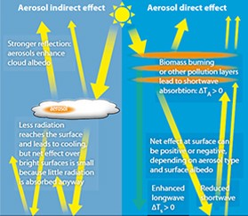
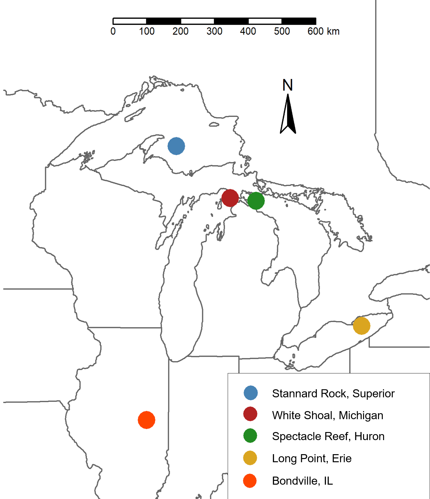
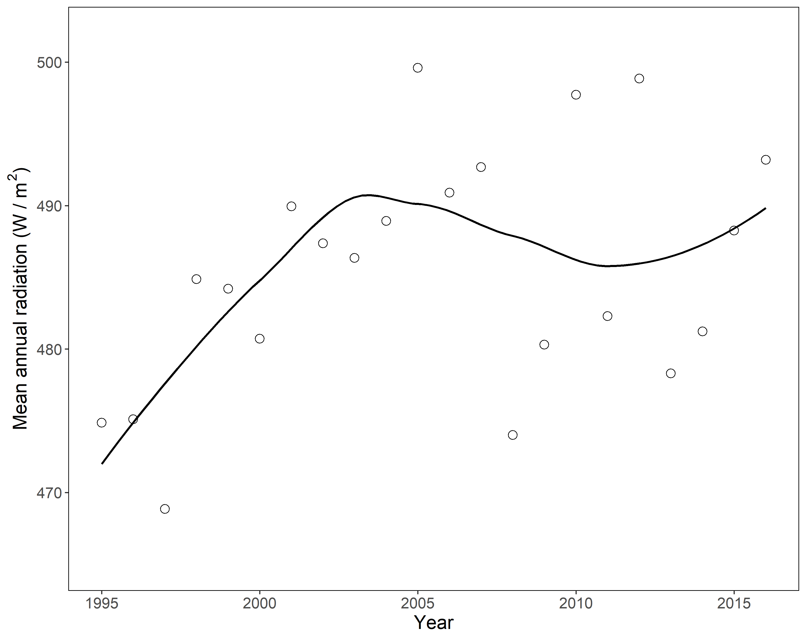
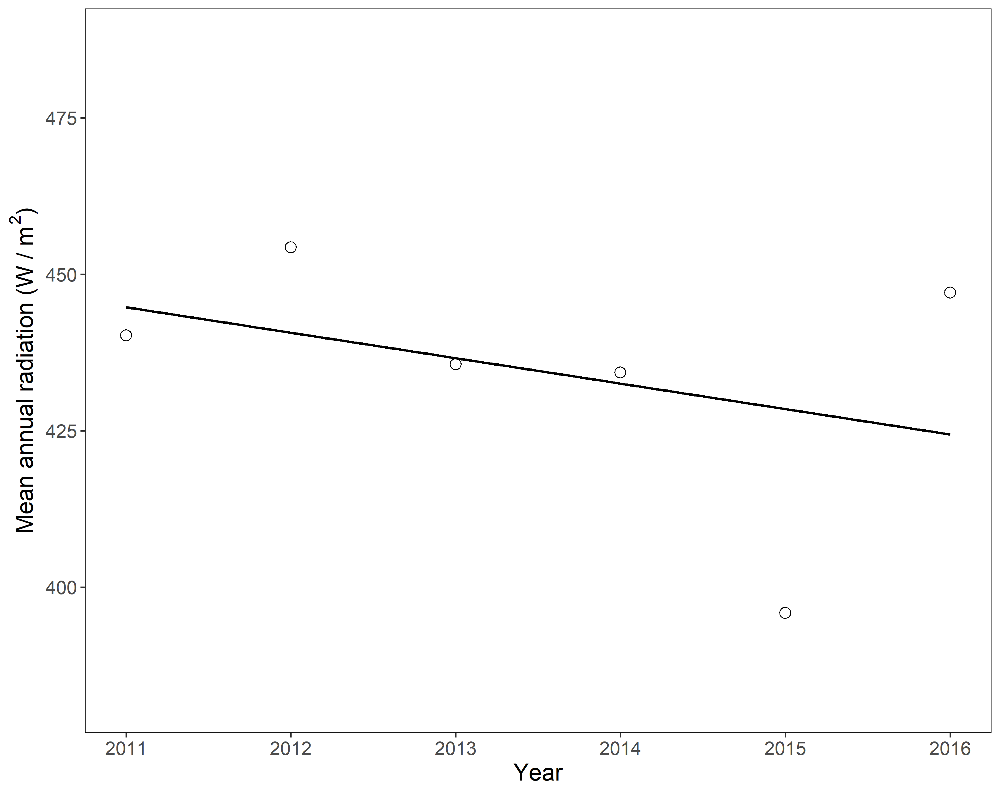
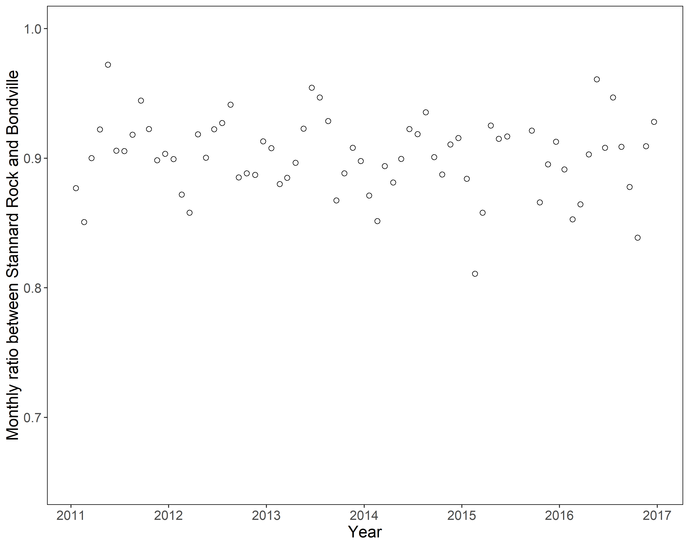
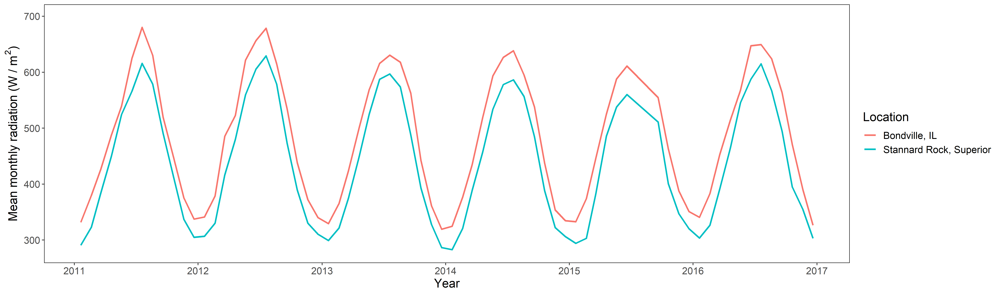

```{r setup, include=FALSE}
knitr::opts_chunk$set(echo = FALSE)

# Learn more about creating blogs with Distill at:
# https://rstudio.github.io/distill/blog.html

```

Skills practiced:  
  
* Developing research question and hypothesis, preparing literature review  
* Collecting data from different sources  
* Converting POSIX timestamp to date-time (lubridate package in R)  
* Wrangling, binding, summarizing large datasets - several million rows (dplyr package in R)
* Performing statistical tests and producing charts (Kendall, ggplot2 packages in R)  
* Writing a research report and creating a poster presentation
  
*Final report can be found **[here](solar_rad_report.pdf)**.*  
*Presented at Northern Michigan University's Celebration for Student Scholarship, April 2019. The first-place poster can be found **[here](solar_rad_poster.jpg)**.*  

# Background  
I was a student research assistant Summer-Fall 2018 with the Great Lakes Evaporation Network. NASA was installing some weather equipment on Granite Island (12 miles NW of Marquette) as part of their Clouds and Earth Radiant Energy System, so I assisted with installing this equipment. I learned that there is similar equipment on four other lighthouses on the Great Lakes. My research adviser [John Lenters](https://www.mtu.edu/greatlakes/people/faculty-staff/lenters/) was explaining to me how solar radiation affects evaporation off the Great Lakes and since atmospheric aerosols (pollution, soot, smoke) are decreasing, the Earth's surface is experiencing more solar radiation than it has in decades.  

Solar radiation primarily comes in two types:  
  
* Shortwave: Visible light and ultra-violet. Contains a lot of energy.  
* Longwave: Infrared. Contains less energy, is experienced as heat.  

This radiation is responsible for warming the earth day-to-day, providing plants with energy for photosynthesis, and giving us sunburn. The atmosphere absorbs some of this radiation and the more atmosphere it needs to travel through, the less radiation reaches the surface--the reason for the change of seasons in the northern/southern latitudes.  

Studies have shown that developing nations are experiencing less solar radiation on the surface than before they began industrialization. This can be attributed to the addition of atmospheric *aerosols* in the form of soot, smog, and other anthropogenic emissions. Similarly, wildfire smoke and volcanic ash cool the surface of the Earth when suspended in the atmosphere. These microscopic particles block some of the radiation from reaching the surface, and absorb and re-emit it as heat in the atmosphere. This concept is called *global dimming*. Additionally, water vapor relies on an atmospheric aerosol as a condensation nucleus for droplet and cloud formation.  

```{r, out.width = "400px", fig.align='center', fig.cap = "How aerosols affect the incoming solar radiation. Diagram from http://www.maceb.fi/climatic_impacts.html"}



```

Because aerosols warm the upper atmosphere, they are working together with the greenhouse effect to warm the planet. Coincidentally since the industrial revolution in the nineteenth century, we experienced the cooling effect of global dimming in conjunction with the warming effects, so there was little noticeable temperature change on the surface of the Earth.  

In the 1970s, legislation was passed to combat air quality concerns impacting human health and environmental processes. As emissions decreased over a few decades, atmospheric aerosol concentrations decreased as well, called *global brightening*. We began experiencing the warming effects that the past century of industry produced--in both normal solar radiation levels and higher atmospheric temperatures--and realized that anthropogenic global warming is a real phenomenon.  

Knowing that solar radiation significantly affects water levels, I wondered *is there a trend in global brightening across the Great Lakes region?*

# Methods  

The Great Lakes Evaporation Network was a recent initiative and radiation monitoring stations only had 3-6 years of data depending on location. By definition, *climate trends* are established over 30 year periods. The National Oceanic and Atmospheric Administration (NOAA) installed a solar radiation monitoring station in Bondeville, IL, in 1994. This was the closest and longest running monitoring station in the Great Lakes region.  

```{r, out.width = "400px", fig.align='center', fig.cap = "A map of the Great Lakes region, with the locations of the four Great Lakes Evaporation Network monitoring stations on each of the lakes, as well as the Bondeville station in Illinois."}



```

1. I used this 23-year period at Bondeville, IL, to determine solar radiation trends using the Mann-Kendall non-parametric test. The data was processed to yearly averages to determine long-term trends. This method was also used for Stannard Rock, MI, even though there was not a significant amount of data.  

2. The 6-year data from Stannard Rock was compared to Bondeville to see if they behave similarly. The monthly solar radiation averages from Bondeville from 2011-2017 were compared as a ratio to Stannard Rock montlhy averages of the same time period.  

3. A linear regression was performed to determine whether the averages were diverging or converging, which would mean that the stations *do not* experience similar radiation patterns.  

# Discussion  

* With marginal significance (p = 0.055), the Bondeville station is "brighter" now that it was two decades ago.  

```{r, out.width = "500px", fig.align='center', fig.cap = "The yearly averages of solar radiation in Bondeville, IL, with a loess smoothing trendline to aid in visualization."}


```

* There is no significant trend at Stannard Rock, which was expected as only six years of data exist.  

```{r, out.width = "500px", fig.align='center', fig.cap = "The yearly averages of solar radiation at Stannard Rock, MI, with a linear trendline to aid in visualization."}


```

* The linear regression showed there is no significant trend in the ratio of monthly solar radiation averages between Bondeville and Stannard Rock, which suggests that both stations are experiencing similar radiation patterns.  

```{r, out.width = "500px", fig.align='center', fig.cap = "The ratio of monthly averages between Bondeville and Stannard Rock between 2011 and 2017."}


```

```{r, out.width = "700px", fig.align='center', fig.cap = "A sinusoidal plot of monthly averages to visually compare the slopes over time. Stannard Rock's values are lower due to it's higher latitude. July 2014 is missing values."}


```

Because Stannard Rock and Bondeville appear to experience similar solar radiation patterns, we can conclude that the Great Lakes are likely also brighter than they were 26 years ago. The White Shoal and Spectacle Reef in Lakes Michigan and Huron probably experience similar patterns as well.  

In conjunction with higher atmospheric temperatures, increased solar radiation could have a significant impact on the Boreal Forest ecosystems of Northern Michigan due to water availability, climate sensitivity, and competitor migration (broadleaf hardwoods). While photosynthesis and carbon sequestration will increase, this benefit is likely short lived because of the sensitivity of boreal ecosystems.  

This project certainly has limitations, primarily in the availability of long-term data. These are discussed in the final [report](solar_rad_report.pdf).  