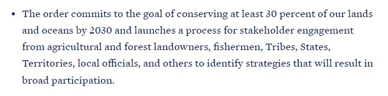
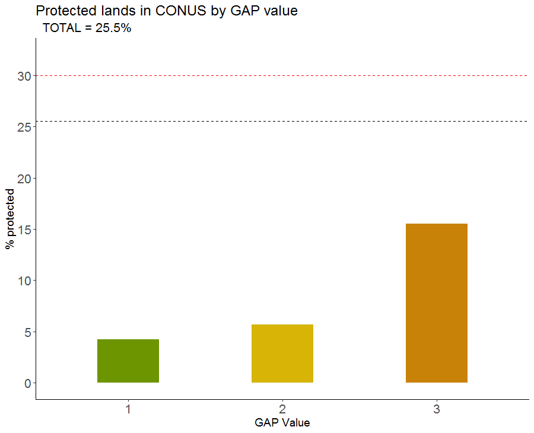
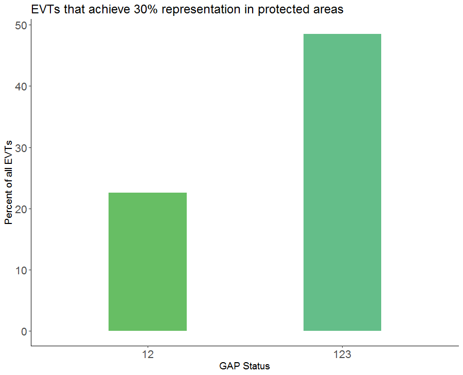

```{r setup, include=FALSE}
knitr::opts_chunk$set(echo = FALSE)
# htmltools::includeHTML("RepresentationRevisitedSlides.html")

# Learn more about creating blogs with Distill at:
# https://rstudio.github.io/distill/blog.html

```

Presented at International Association of Landscape Ecology conference, April 2021.  
  
# Skills practiced in R  
  
* Defining a project question, developing methods, collecting data, performing analysis  
* Accessing ESRI geodatabase layers (sf package)  
* Stacking and extracting raster values from shapefile boundaries (raster, sf packages)  
* Cleaning, joining, analyzing data frames (dplyr package)  
* Creating charts (ggplot2 package)  
* Producing interactive webmap (tmap package)  
  
*Final slideshow can be found **[here](RepresentationRevisitedSlides.html)**.*  
*This is an **[interactive map](c3.html)**. It shows GAP status and ecosystem types for each Ecoregion (explained below). The layers can be toggled on/off on the upper left side, below the zoom controls. Note: the EVT raster was converted to lower resolution for mapping purposes. Explore away!*  
  
# Background  
In January 2021, the Biden administration announced that the United States will work toward the goal of conserving 30% of U.S. lands and oceans by 2030, also known as the **["30 by 30"](https://www.whitehouse.gov/briefing-room/statements-releases/2021/01/27/fact-sheet-president-biden-takes-executive-actions-to-tackle-the-climate-crisis-at-home-and-abroad-create-jobs-and-restore-scientific-integrity-across-federal-government/)** initiative.  

```{r, out.width = "600px", fig.align='center', fig.cap = "A snippet from the 30x30 initiative."}



```
Ecologists and conservationists everywhere applauded this initiative as our careers are often devoted to protecting the natural systems that all life relies on. Brandon and I were also happy to hear this announcement, but as scientists we had questions lingering within our discussions:  
  
* What do they mean by "conserving" land? Will these be untouched wilderness areas to protect biodiversity, or will they be protected from development but still logged?  
* How will they conserve land? Will they conserve sagebrush scrubland in Nevada and ignore the old-growth forests in Oregon, and call it "good"?  
* How do we currently define "conservation" in the United States?  
* How can we assess where we are at and how much more we have to go?
  
# Datasets  
  
<font size="4">**The Nature Conservancy Terrestrial Ecoregions, 2016**</font>  
  
* Divides the country into geographic regions based on similar climate, vegetation, geology, and other ecological and environmental patterns.  
* We chose this dataset because it separates the country into regions based on ecological similarities rather than political boundaries.  
* It can be accessed *[here](https://geospatial.tnc.org/datasets/b1636d640ede4d6ca8f5e369f2dc368b/about)*.  
  

<font size="4">**USGS Protected Areas Database of the United States 2.0, 2018**</font>  
  
* A national inventory of the nation's protected areas, including public land and private protected areas.  
* We chose this dataset because it is the most complete, credible resource available, plus it defines different rankings of ecological protection.  
* GAP Status:
  + Level 1: Areas managed for biodiversity where *natural disturbances are allowed* to proceed.  
  + Level 2: Areas managed for biodiversity where *natural disturbance is suppressed*.  
  + Level 3: Areas protected from land conversion, but *subject to extractive uses*.  
* It can be accessed *[here](https://www.sciencebase.gov/catalog/item/5b030c7ae4b0da30c1c1d6de)*.  
  

<font size="4">**LANDFIRE Existing Vegetation Type 2.2.0, 2016**</font>  
  
* Shows the distribution of vegetative communities across the United States at 30 x 30 m resolution.  
* We chose this dataset because it is a detailed, yet broad, description of ecosystems across the country, which is perfect for identifying major ecosystems within an ecoregion.  
* It can be accessed *[here](https://landfire.gov/version_download.php)*.  
  
# Methods  
  
1. Cropped the Ecoregion and Protected Areas Database (PADUS) shapefiles to the continental United States.  
2. Extracted Existing Vegetation Type (EVT) counts within each Ecoregion as a whole and displayed it as a data frame. Performed the same process on PADUS areas *within* each Ecoregion.  
3. Joined both datasets by Ecoregion. Summarized total acres and total acres protected at each GAP status.
4. Calculated relative percentages of ecosystem conservation under three protection regimes: fully natural processes (GAP 1), prioritize biodiversity (GAP 1, 2), prevent land conversion (GAP 1, 2, 3).  
5. Calculated the relative percentages of EVTs occurring inside and outside protected areas of each Ecoregion, using 30% representation as the goal.


# Discussion  
  
* 25.5% of land is protected from development or conversion, and *more than half* is subject to resource extraction.  
* 9.9% of land is protected for biodiversity purposes.  
* Only 4.2% of land is protected for biodiversity and allow for *all* natural ecological processes to occur.  

```{r, out.width = "600px", fig.align='center', fig.cap = "All protected lands in United States under each GAP status. Black dashed line is total percent protected under GAP 1, 2, 3 and red dashed line is our 30% goal."}



```
  
<font size="4"><p style="text-align: center;">*How should we define "conservation" in the United States?*</p></font>  
  
* Is it solely to prevent conversion to subdivisions or agriculture? Are we allowed to systematically extract resources from it, effectively disturbing natural regimes? If so, we have less than 5% to go.  
* Do we prioritize biodiversity and prevent significant human impact from disrupting natural processes? If this is the avenue we take, we have about 20% more to go.  
  
```{r, out.width = "600px", fig.align='center', fig.cap = "This chart shows the percentage of ecosystem types (EVTs) that are in protected areas at 30% or greater representation under different conservation regimes (GAP status)."}



```

<font size="4"><p style="text-align: center;">*Is it valuable to consider what types of land we choose to protect moving forward?*</p></font>  

Because Biden's plan is to conserve 30% of U.S. land, we decided that 30% of each ecosystem type should also be protected, in order to properly represent the ecosystems and their functions. This way, we don't have 27% sagebrush, 2% northern hardwoods, 1% old growth conifer forest, and 0% oak savanna in our protected areas. How is that conservation?  
  
* 45.8% of EVTs are protected from land conversion at 30% or greater representation.  
* 22.6% of EVTs are protected for biodiversity at 30% or greater representation.  

  
*This is an **[interactive map](c3.html)**. It shows GAP status and ecosystem types for each Ecoregion. The layers can be toggled on/off on the upper left side, below the zoom controls. Note: the EVT raster was converted to lower resolution for mapping purposes. Explore away!*  
