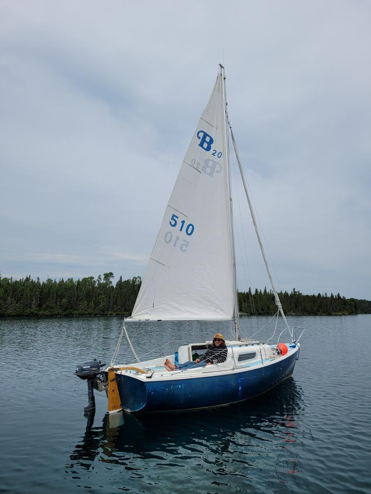

```{r setup, include=FALSE}
knitr::opts_chunk$set(echo = FALSE)

```
<p style="text-align: center;">*Feel free to reach out, I will respond as soon as I can*</p>   
<p style="text-align: center;">*Phone calls and voicemails are welcome!*</p>  
<br>  
<p style="text-align: center;">email: [mwalimaa@gmail.com](mailto:mwalimaa@gmail.com)</p>  
<p style="text-align: center;">mobile phone: (248) 298-9574</p>  
<br>  
<br>  
```{r, out.width = "600px", fig.align='center'}



```