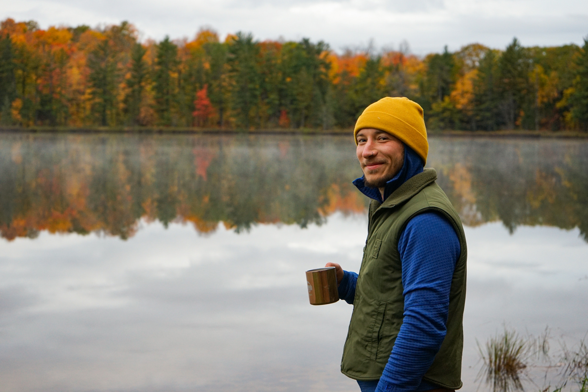

```{r setup, include=FALSE}
knitr::opts_chunk$set(echo = FALSE)

# Learn more about creating websites with Distill at:
# https://rstudio.github.io/distill/website.html

```


```{r, out.width = "450px", fig.align='center'}


```


<font size="5"><p style="text-align: center;">**I am a spatial ecologist, data coder, and field technician.**</p></font>  
As a seasonal National Park Service employee, I spend half my year on Isle Royale collecting data, handling wildlife, operating boats, paddling, hiking... and I spend the other half doing freelance GIS and data management work, working on as many mini-projects I can juggle, and exploring the country's natural spaces.  
<br>
My studies in college provided a strong foundation in earth science, biology, chemistry, and conservation. I continue to build off of this by learning new skillsets through independent research. I taught myself the R coding language and contributed to many projects, as well as developing a batch-processing script for The Nature Conservancy to analyze ecosystem distribution for any area-of-interest across the United States.  
<br>
My current pursuits are learning Python in the ArcGIS setting, SQL for database management, and remote sensing processes for analyzing LiDAR and aerial imagery.
<br>

```{r, out.width = "700px", fig.align='center'}



```